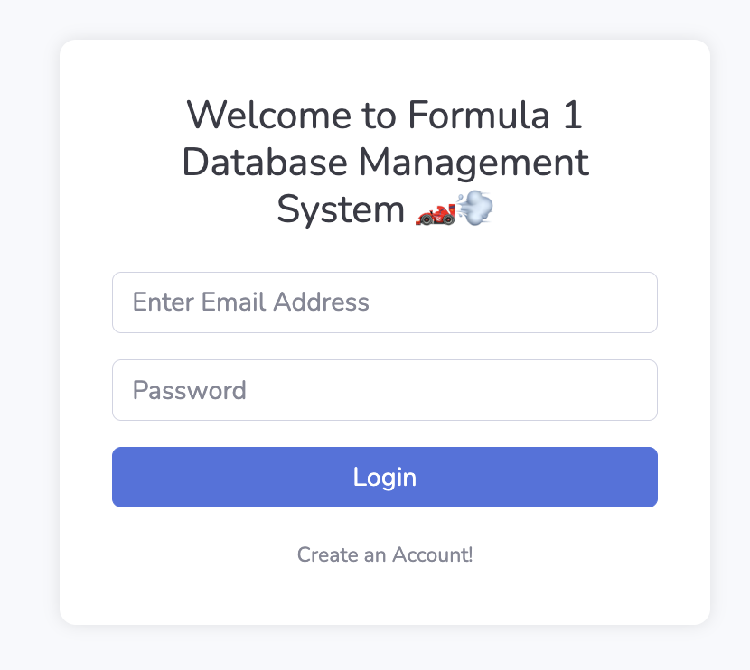
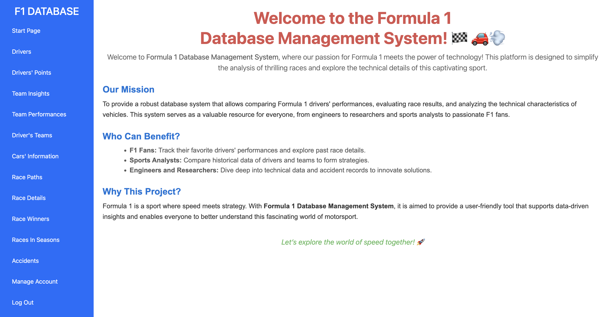
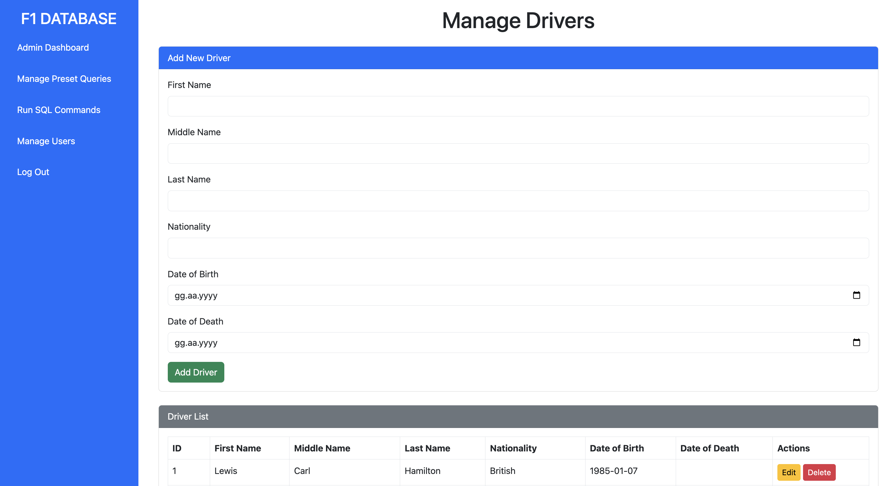
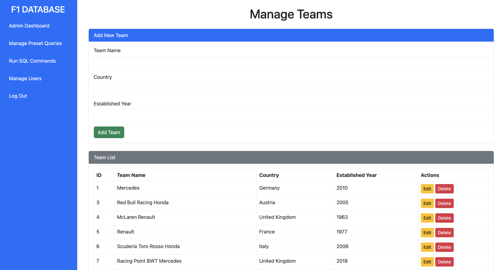
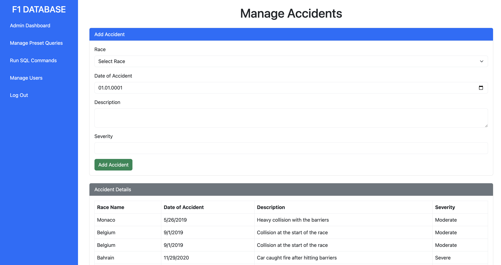
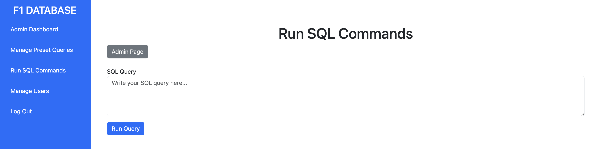
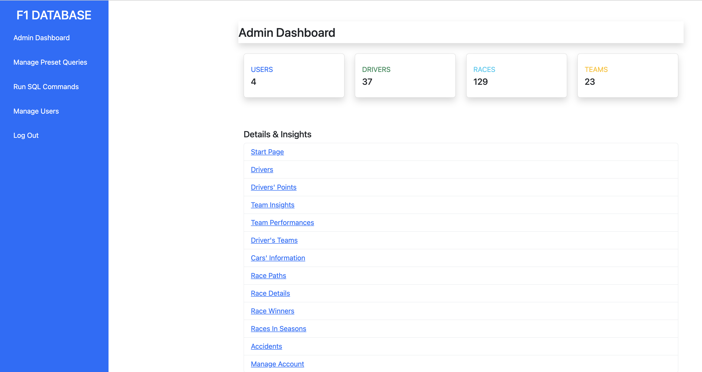

# 🏎️ Formula 1 Database Management System

This is a **full-stack web application** developed as part of an academic project to manage and explore Formula 1 data using C# and Razor Pages.  

It integrates a Microsoft SQL Server `.bacpac` database and provides a clean user interface to view driver stats, race outcomes, car specs, team performance and more.

> _Let’s explore the world of speed together!_ 🚀

---

## ⚙️ Technologies Used

- **C#** – Backend logic and data processing  
- **ASP.NET Core Razor Pages** – For building dynamic web UI  
- **Microsoft SQL Server** – Relational database (.bacpac format)  
- **Git & GitHub** – Version control and collaboration  
- **Visual Studio Code** – Development environment 

---

## 📁 Project Structure

- `F1DatabaseLogin/` – Contains all pages, backend logic, and Razor files (.cshtml)
- `wwwroot/` – Static files (CSS, JS, Fonts)
- `Formula1-2024-12-27-23-36.bacpac` – SQL Server database export file used in the project
- `README.md` – Project overview file (this one!)

---

## 🧩 Features

- 🔐 User registration and login system
- 👤 Role-based page access (e.g. admin panel)
- 🏎️ Manage drivers, cars, and teams
- 🏁 Add and update races, seasons and race paths
- 💥 Log and display race accidents
- 📊 View driver performance and team insights
- 🧠 Admin dashboard with custom SQL command execution
- ✅ Predefined queries and result visualizations
- 🔎 Filterable and editable race data entries (seasons, winners, points, etc.)
- 🗃️ Organized modular pages for each entity (drivers, cars, teams, races)

---

> ℹ️ This web application includes **15+ Razor Pages** with full CRUD support, an **admin panel**, **user authentication**, **real-time SQL execution** and more. Explore the full source for all features!

---

## 🖼️ Sample Screenshots

| Login Page | Start Page |
|------------|------------|
|  |  |

| Manage Drivers | Manage Teams |
|----------------|--------------|
|  |  |

| Manage Accidents | Run SQL Commands |
|------------------|------------------|
|  |  |

| Admin Dashboard |
|-----------------|
|  |
> 📌 The admin dashboard summarises all system data and provides links to manage each entity.

